<h1>Steps for Test Task</h1>
<ul>
  <li>Step1: 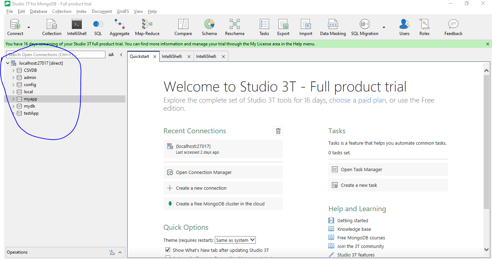</li>
  <li>Step2: 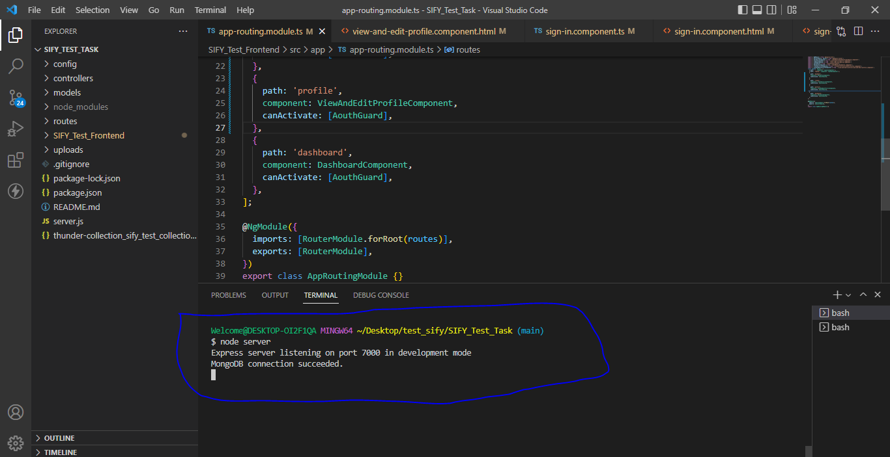</li>
  <li>Step3: 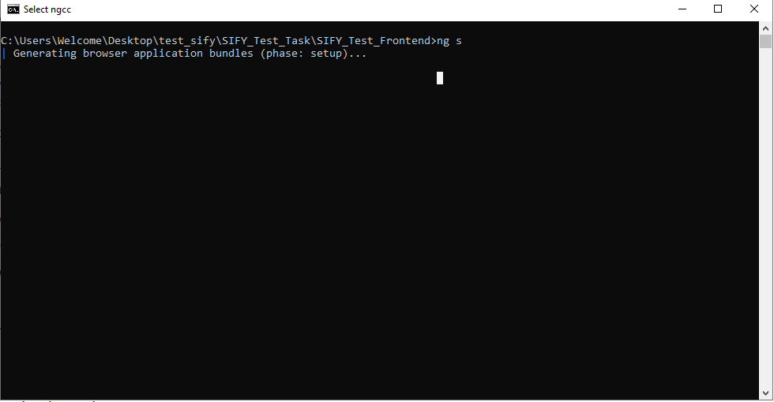</li>
  <li>Step4: 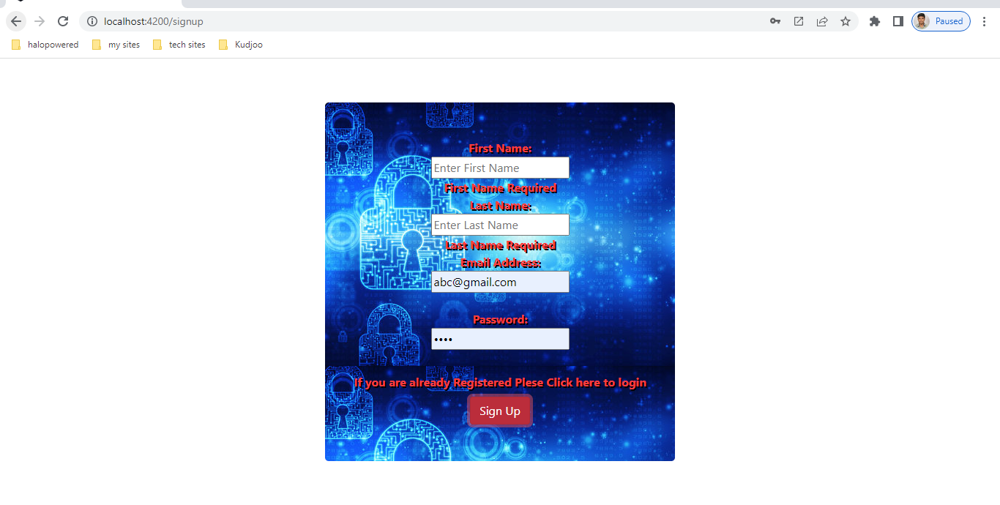</li>
  <li>Step5: 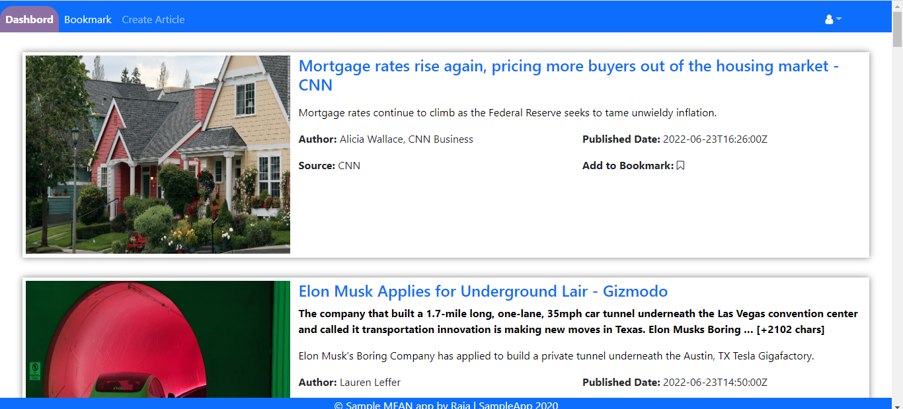</li>
  <li>Step6: 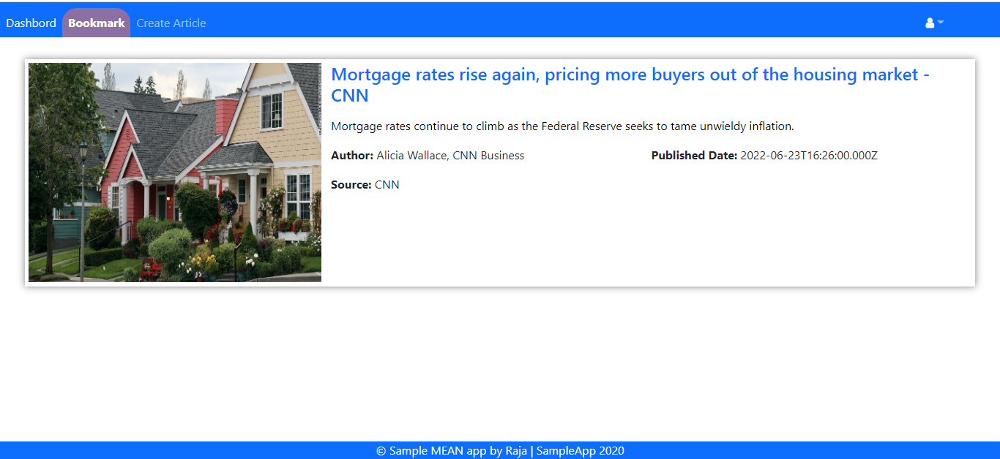</li>
  <li>Step7: 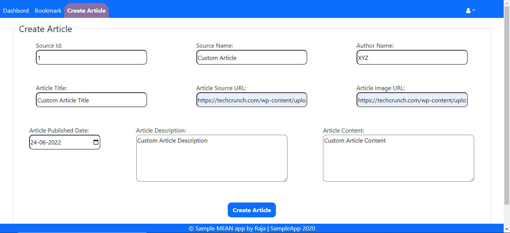</li>
  <li>Step8: 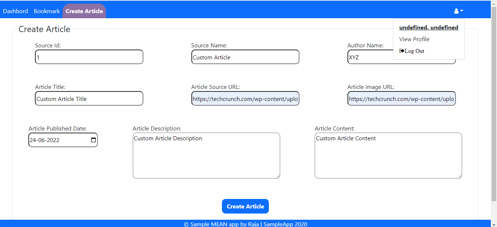</li>
  <li>Step9: 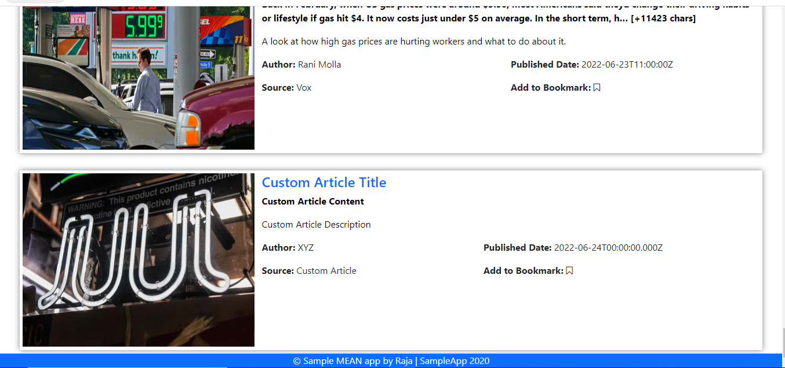</li>
  <li>Step10: 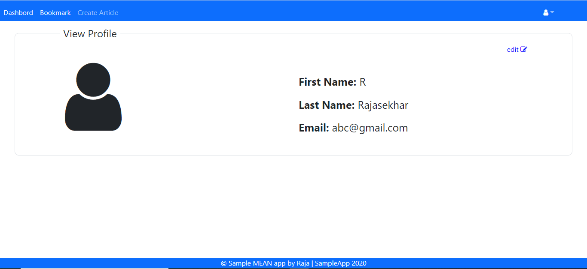</li>
  <li>Step11: 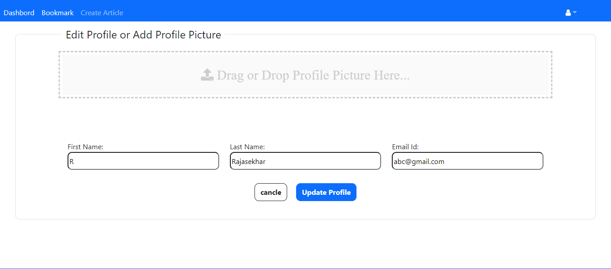</li>
  <li>Step12: </li>
  <li>Step13: 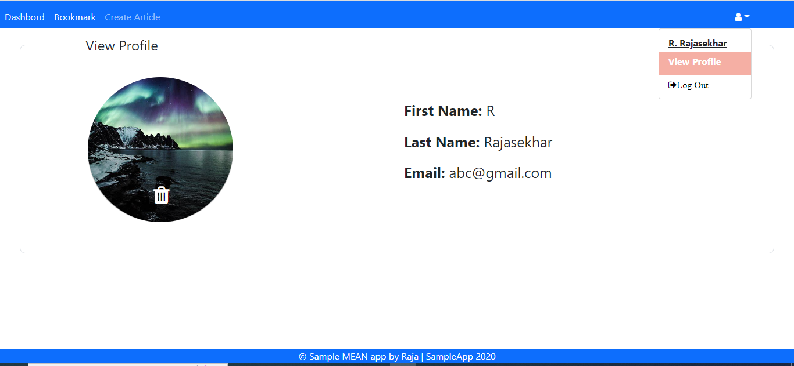</li>
  <li>Step14: 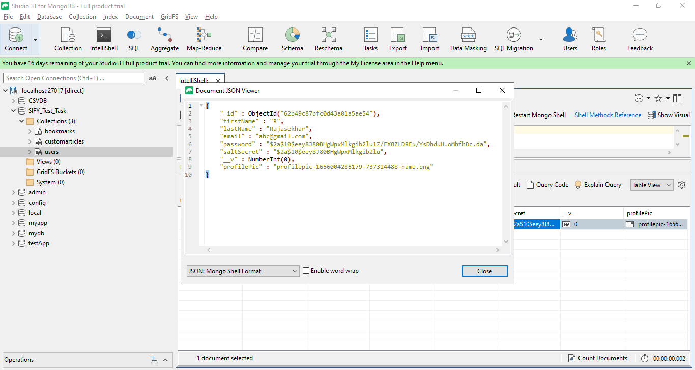</li>
  <li>Step15: 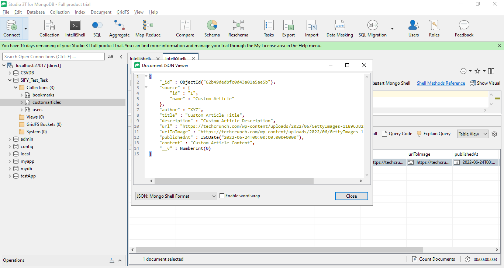</li>
  <li>Step16: 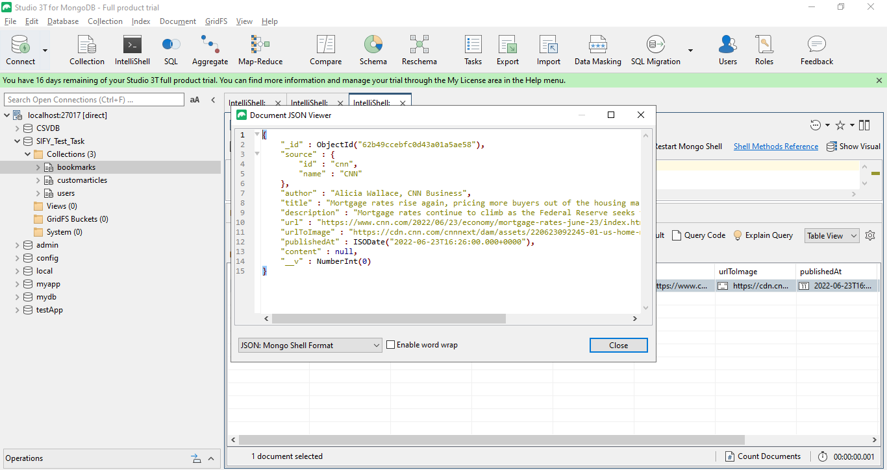</li>
</ul>
